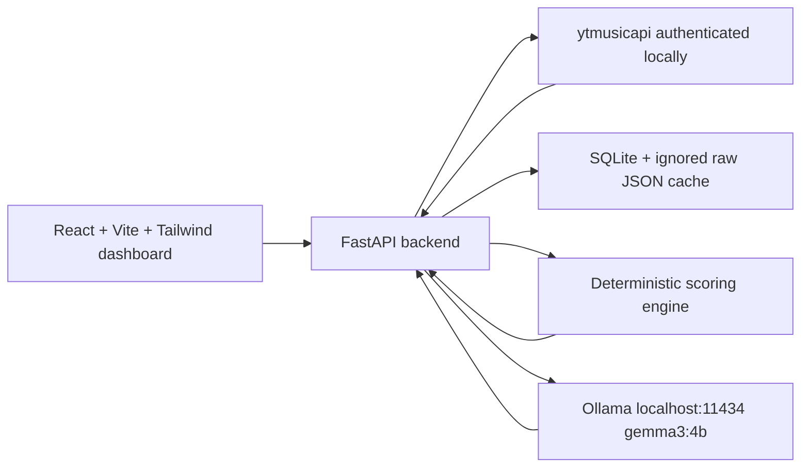

# Saville Music Persona

Saville Music Persona is a private, local-first web app that analyses your YouTube Music listening taste with `ytmusicapi`, then asks a locally installed Ollama model (`gemma3:4b`) to write a polished music-personality report from the calculated facts.

No OpenAI, Gemini, Spotify, or paid cloud API key is required. Credentials, cached history, reports, and playlist exports stay on your Windows laptop.

## Screenshots

Screenshots are intentionally left out until you run the app against your own private data. The dashboard includes:

- Overview hero and analysis coverage card
- Top 10 songs and artists
- Transparent score gauges
- Listening pattern charts
- AI persona report modes
- Evidence-driven recommendations
- Connect YouTube Music settings page

## Architecture



## Local prerequisites

- Windows PowerShell
- Python 3.11 or newer
- Node.js 20 or newer
- npm
- Git
- Ollama
- Ollama model `gemma3:4b`

## Setup on Windows

From the repository root:

```powershell
powershell -ExecutionPolicy Bypass -File .\scripts\setup_windows.ps1
```

The setup script checks prerequisites, creates `backend\.venv`, installs backend/frontend dependencies, verifies Ollama, and pulls:

```powershell
ollama pull gemma3:4b
```

If Ollama is missing and `winget` is available, the script prints:

```powershell
winget install Ollama.Ollama
```

## YouTube Music authentication

Read [docs/AUTH_SETUP.md](docs/AUTH_SETUP.md).

Short version:

```powershell
New-Item -ItemType Directory -Force .\backend\private
$env:YTMUSIC_OAUTH_CLIENT_ID="your-client-id"
$env:YTMUSIC_OAUTH_CLIENT_SECRET="your-client-secret"
$env:YTMUSIC_AUTH_FILE="backend/private/oauth.json"
```

Then generate `backend/private/oauth.json` using the `ytmusicapi oauth` flow from the virtual environment. Keep that file private.

## Run the app

```powershell
powershell -ExecutionPolicy Bypass -File .\scripts\run_dev.ps1
```

Default URLs:

- Frontend: `http://localhost:5173`
- Backend: `http://localhost:8000`

## Development commands

```powershell
npm.cmd --prefix frontend run dev
npm.cmd --prefix frontend run build
npm.cmd --prefix frontend run lint
backend\.venv\Scripts\python.exe -m pytest backend\tests
backend\.venv\Scripts\python.exe -m uvicorn app.main:app --app-dir backend --reload --host 127.0.0.1 --port 8000
```

## Privacy and security

The repository ignores:

- `backend/private/`
- `oauth.json`
- browser headers
- cookies
- `.env`
- SQLite databases
- `data/raw/`
- raw history exports
- `node_modules`
- build output

Never commit account data or authentication files.

## Known limitations

- `ytmusicapi` is unofficial and may change when YouTube Music changes.
- YouTube Music history availability may not cover a full year.
- Play timestamps may be relative, missing, or not parseable.
- Genre, subscriber, and release-year metadata may be incomplete.
- The LLM explains calculated data; it does not decide facts.
- The app never claims a full 365-day analysis unless the available dated history supports it.

## Troubleshooting

- **PowerShell blocks npm:** use `npm.cmd`, which the scripts prefer automatically.
- **Ollama unavailable:** install Ollama, start it, and run `ollama pull gemma3:4b`.
- **Gemma missing:** run `ollama list`; if `gemma3:4b` is absent, run `ollama pull gemma3:4b`.
- **YouTube Music not connected:** check `backend/private/oauth.json` and the two `YTMUSIC_OAUTH_*` environment variables.
- **No full-year coverage:** the API did not expose enough parseable dated history. The dashboard will switch to partial or available-history analysis.

## Git workflow

Recommended commit flow:

```powershell
git status
git add .
git commit -m "feat: build Saville Music Persona local dashboard"
git branch -M main
git remote add origin https://github.com/aidanchan0623/Saville-Music-Persona.git
git push -u origin main
```

