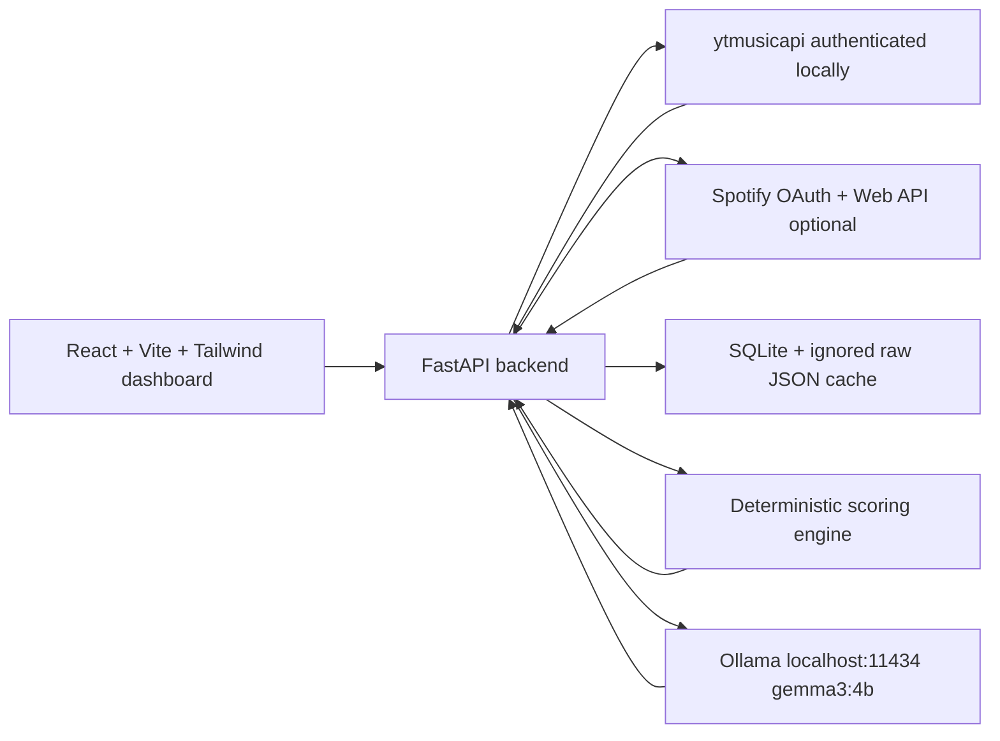

# Saville Music Persona

Saville Music Persona is a private, local-first web app that analyses your YouTube Music listening taste with `ytmusicapi`, optionally analyses a separate Spotify profile, then uses deterministic Music Character rules with an optional local Ollama model (`gemma3:4b`) to write a polished music-personality report.

No OpenAI, Gemini, or paid cloud API key is required. Credentials, cached history, reports, and playlist exports stay on your Windows laptop.

## Screenshots

Screenshots are intentionally left out until you run the app against your own private data. The dashboard includes:

- Lightweight Overview hero with timeframe controls, Most Active Sound, analysis coverage, and one Persona Report entry point
- Detected Listening Time overview
- Monthly and rolling-year Top 10 songs and artists
- Consolidated Insights dashboard for listening profile, scores, rhythm and rankings
- Music-family radar profile with explicit genre-classification coverage
- Compact listening score gauges with transparent formulas
- Weekly/monthly detected-minutes rhythm toggle
- Top artists, repeated songs and recent daily intensity
- Cinematic five-chapter Persona Report controlled by natural scrolling
- Deterministic Music Character classification from the canonical personality registry
- Period-specific detected listening time, genre shares, and Top 5 rankings
- Deterministic Musical Age with its rolling-year source period shown explicitly
- Gemma-written descriptions and final roast with complete deterministic fallbacks
- One persistent decorative album-dome background built from real ranked album covers
- Evidence-driven recommendations
- Connect YouTube Music settings page
- Optional Spotify login/profile source switcher

## Architecture



## Local prerequisites

- Windows PowerShell
- Python 3.11 or newer
- Node.js 20 or newer
- npm
- Git
- Ollama
- Ollama model `gemma3:4b`

## Setup on Windows

From the repository root:

```powershell
powershell -ExecutionPolicy Bypass -File .\scripts\setup_windows.ps1
```

The setup script checks prerequisites, creates `backend\.venv`, installs backend/frontend dependencies, verifies Ollama, and pulls:

```powershell
ollama pull gemma3:4b
```

If Ollama is missing and `winget` is available, the script prints:

```powershell
winget install Ollama.Ollama
```

## YouTube Music authentication

Read [docs/AUTH_SETUP.md](docs/AUTH_SETUP.md).

Short version:

```powershell
New-Item -ItemType Directory -Force .\backend\private
$env:YTMUSIC_OAUTH_CLIENT_ID="your-client-id"
$env:YTMUSIC_OAUTH_CLIENT_SECRET="your-client-secret"
$env:YTMUSIC_AUTH_FILE="backend/private/oauth.json"
```

Then generate `backend/private/oauth.json` using the `ytmusicapi oauth` flow from the virtual environment. Keep that file private.

## Optional Spotify authentication

YouTube Music remains the default source. Spotify is optional and stored separately, so disconnecting Spotify does not delete or overwrite YouTube Music or Google Takeout data.

1. Create an app in the [Spotify Developer Dashboard](https://developer.spotify.com/dashboard).
2. Add this redirect URI to the Spotify app:

```text
http://localhost:8000/api/spotify/callback
```

3. Put credentials in `backend/private/.env` or your local shell, never in Git:

```powershell
SPOTIFY_CLIENT_ID=your-spotify-client-id
SPOTIFY_CLIENT_SECRET=your-spotify-client-secret
SPOTIFY_REDIRECT_URI=http://localhost:8000/api/spotify/callback
```

4. Run the backend and frontend, open Settings, and click Connect Spotify.
5. If your Spotify app is in Development Mode, add each friend/account as an allow-listed user in the Spotify dashboard.

Spotify data uses top tracks, top artists, saved songs, playlists, and recent plays. Spotify does not provide a Google Takeout-style full historical play-count export through the Web API, so Spotify monthly history improves after repeated syncs.

## Run the app

```powershell
powershell -ExecutionPolicy Bypass -File .\scripts\run_dev.ps1
```

Default URLs:

- Frontend: `http://localhost:5173`
- Backend: `http://localhost:8000`

## Development commands

```powershell
npm.cmd --prefix frontend run dev
npm.cmd --prefix frontend run build
npm.cmd --prefix frontend run lint
backend\.venv\Scripts\python.exe -m pytest backend\tests
backend\.venv\Scripts\python.exe -m uvicorn app.main:app --app-dir backend --reload --host 127.0.0.1 --port 8000
```

## Detected listening minutes

Saville Music Persona never claims to know exact listening time.

**Detected listening minutes** means the sum of full track durations for listening events recorded in the local merged history dataset.

The app can know that a track appeared in local history data, but it cannot reliably know whether you listened to every second, skipped early, replayed only part of it, or left playback running in the background. Minutes are therefore shown as an estimate from detected track durations.

Rules:

- Events with no trustworthy duration stay in play-count analysis but are excluded from minute totals.
- Obvious podcasts, interviews, livestreams, playlists, very long videos, and other longform/non-music entries are marked with an exclusion reason.
- Duration coverage is shown beside minute-based stats.
- The duration cache is stored locally so successful YouTube Music duration lookups are reused.
- Confidence badges are based on usable-duration coverage: High confidence is 90% or higher, Good coverage is 75-89%, Partial coverage is 50-74%, and Limited is below 50%.

## Period definitions

Period analytics use the configured local timezone. The default is `Asia/Kuala_Lumpur`; set `SMP_LOCAL_TIMEZONE` to change it.

- **This Month**: the current calendar month in the configured local timezone.
- **Select Month**: one historical calendar month with detected history.
- **Rolling Year**: the latest 365 days ending today in the configured local timezone.
- **Last 7 / Last 30**: calendar-day windows ending today.
- **All Available History**: every dated event in the local cache.

For daily charts, missing days are preserved as zero. For Top 10 movement, the app compares the selected period with the immediately preceding equivalent period when enough prior data exists.

## Ranking and labels

Top songs and artists are ranked by deterministic detected play counts. Detected listening minutes break some ties, then stable text sorting keeps results reproducible.

Interpretation labels are deterministic:

- **Current obsession**: strong current rank without being a rolling-year anchor.
- **Long-term anchor**: highly ranked in both the selected period and rolling-year profile.
- **New arrival**: present now but absent from the immediately preceding comparison period.
- **Returning favourite**: moved up versus the previous equivalent period.
- **One-month spike**: current-period share is much higher than rolling-year share.
- **Comfort favourite**: steady presence without a stronger special-case label.

## Taste DNA methodology

Taste DNA Explorer uses detected plays, curated artist genre mappings, and period filters. Node size reflects listening share. Cluster details show top contributing artists, songs, canonical genres, detected listening minutes, sonic traits, and confidence.

The comparison lens only makes growth/decline claims when the selected period has enough detected plays. Taste DNA is interpretive music analysis, not psychology; it does not diagnose moods, personality, or life circumstances.

## Persona Report

Persona Report is a continuous five-chapter scroll story: Musical Personality, Your Listening World, Musical Age, Top Artists and Songs, and Final Roast. Desktop uses restrained sticky zoom and lateral transitions while tablet and mobile progressively simplify to normal vertical flow. Reduced-motion mode removes the pans, parallax, and ambient album movement without hiding any content.

All report facts are deterministic. The Music Character registry selects the personality, the Musical Age engine selects the age, and the existing period services provide detected minutes, genre coverage, Top 5 songs, Top 5 artists, and background albums. Gemma only writes the short personality description, Musical Age explanation, and final roast. Invalid, unavailable, or stale model output falls back to deterministic language.

The report uses one versioned schema and cache fingerprint that includes the music source, rolling-year report period, analytics data, report schema, prompt, Musical Age calculation, personality classifier, and configured Ollama model. Overview deliberately does not duplicate the report journey.

## Privacy and security

The repository ignores:

- `backend/private/`
- `oauth.json`
- Spotify client secrets and tokens
- browser headers
- cookies
- `.env`
- SQLite databases
- `data/raw/`
- raw history exports
- `node_modules`
- build output

Never commit account data or authentication files.

## Known limitations

- `ytmusicapi` is unofficial and may change when YouTube Music changes.
- YouTube Music history availability may not cover a full year.
- Play timestamps may be relative, missing, or not parseable.
- Detected listening minutes are estimates from full track durations, not exact listening time.
- Google Takeout and YouTube Music history can omit durations, so duration coverage may be partial.
- Spotify does not expose full historical play counts through the Web API; Spotify profiles use top-item, saved-library, playlist, and recent-sync signals.
- Genre, subscriber, and release-year metadata may be incomplete.
- The LLM explains calculated data; it does not decide facts.
- The app never claims a full 365-day analysis unless the available dated history supports it.

## Troubleshooting

- **PowerShell blocks npm:** use `npm.cmd`, which the scripts prefer automatically.
- **Ollama unavailable:** install Ollama, start it, and run `ollama pull gemma3:4b`.
- **Gemma missing:** run `ollama list`; if `gemma3:4b` is absent, run `ollama pull gemma3:4b`.
- **YouTube Music not connected:** check `backend/private/oauth.json` and the two `YTMUSIC_OAUTH_*` environment variables.
- **No full-year coverage:** the API did not expose enough parseable dated history. The dashboard will switch to partial or available-history analysis.

## Git workflow

Recommended commit flow:

```powershell
git status
git add .
git commit -m "feat: build Saville Music Persona local dashboard"
git branch -M main
git remote add origin https://github.com/aidanchan0623/Saville-Music-Persona.git
git push -u origin main
```
